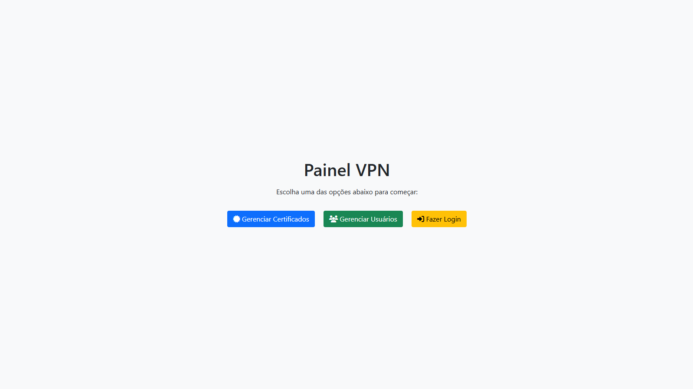
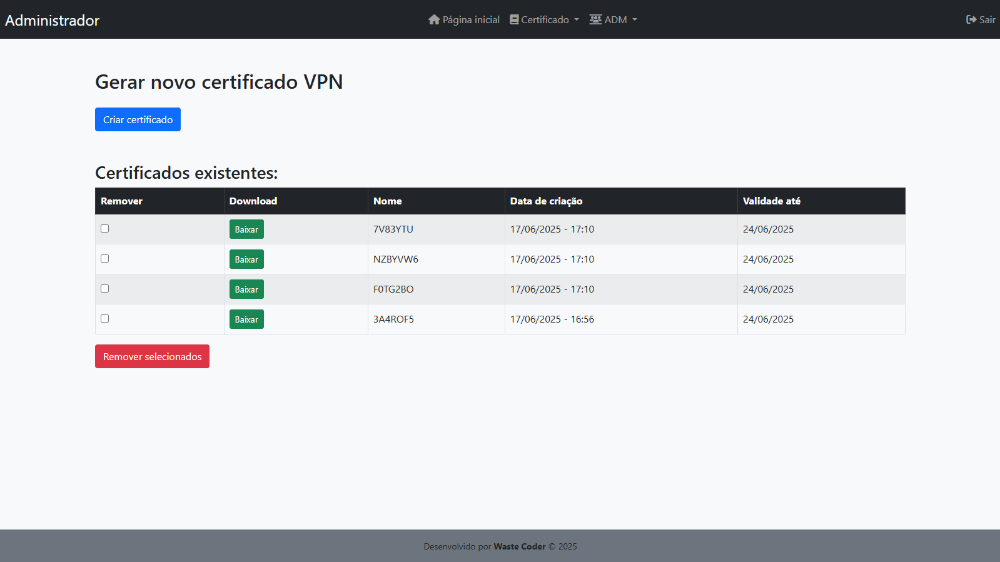
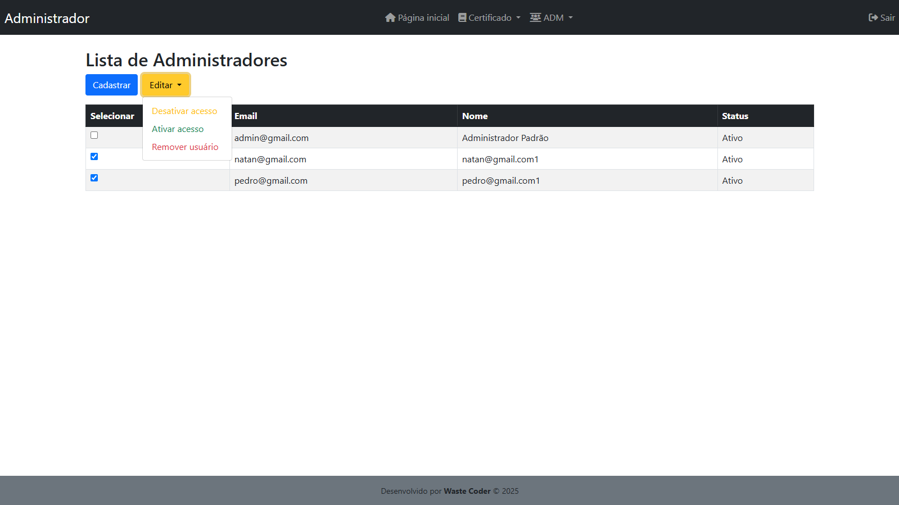
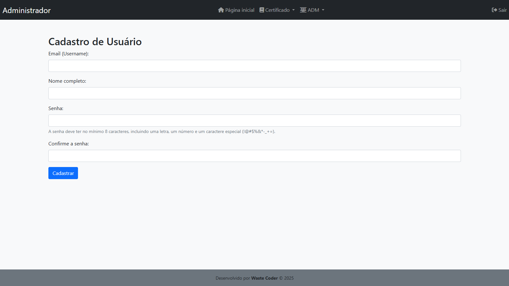

# Painel de Gestão de VPN com Certificados Individuais

O Painel de Gestão de VPN tem como objetivo permitir que cada funcionário da empresa tenha seu próprio certificado de VPN, facilitando a emissão, o download e a revogação de certificados de forma segura e individualizada. O sistema foi projetado para evitar o uso de certificados compartilhados e segue boas práticas de segurança, como controle de acesso e segmentação de rede.

Dentro deste repositório, estão incluídos todos os arquivos necessários para configurar as três VMs utilizadas no projeto. Eles estão organizados em pastas nomeadas conforme suas funções na arquitetura: `OpenVPN`, `Database` e `Firewall`. Cada pasta contém os scripts, configurações e instruções específicas para a respectiva máquina.


---


## Arquitetura da Solução

### Disposição da Rede

O sistema utiliza três máquinas virtuais (VMs), com a seguinte organização de rede:

| Máquina  | IP        | Função                               | Tecnologias Principais |
| -------- | --------- | ------------------------------------ | ---------------------- |
| Firewall | 10.0.0.1  | Controle de acesso externo e interno | nftables               |
| OpenVPN  | 10.0.0.10 | Servidor VPN + Painel Web            | Apache2, PHP           |
| Database | 10.0.0.20 | Banco de dados                       | MySQL                  |

**Observações de comunicação entre as máquinas:**

-   O **Firewall** pode acessar tanto o **OpenVPN** quanto o **Database**.
-   As máquinas **OpenVPN** e **Database** só se comunicam entre si.

### Regras de Firewall Aplicadas

| Porta | Protocolo | Destino | Serviço                      |
| ----- | --------- | ------- | ---------------------------- |
| 80    | TCP       | OpenVPN | Redirecionamento para HTTPS  |
| 443   | TCP       | OpenVPN | Painel Web                   |
| 1194  | UDP       | OpenVPN | Serviço VPN                  |
| 22    | TCP       | OpenVPN | SSH (apenas da rede interna) |

> **Importante:** Todos os outros acessos externos são bloqueados para proteger os servidores internos.


---


## Funcionalidades Principais

### Gestão de Certificados

-   **Criar certificado:** Geração de um identificador único (7 caracteres) e um arquivo `.zip` com os arquivos necessários para conexão VPN (.ovpn, .crt, .key), com validade de 7 dias.
-   **Listar certificados:** Exibição com filtros por data ou identificador.
-   **Download seguro:** Apenas o administrador autenticado pode baixar, via leitura direta de bytes (sem URL pública).
-   **Excluir certificado:** Revoga o certificado no servidor antes da exclusão.

### Gestão de Usuários

-   **Cadastro e listagem:** Criação de novos administradores e exibição de todos os usuários.
-   **Login e autenticação:** Sistema de login protegido, com senhas criptografadas via `password_hash()`.
-   **Proteção de páginas:** Endpoints restritos apenas para usuários autenticados.


---


## Regras de Segurança e Firewall

### Políticas Gerais de Segurança

-   **Política default:** Todo tráfego de entrada e de encaminhamento (forward) é bloqueado por padrão, exceto os explicitamente permitidos.
-   **Permissão apenas para tráfego essencial:** Apenas HTTP/HTTPS, VPN (UDP 1194) e SSH (limitado à rede interna) são aceitos.
-   **Bloqueio de tráfego externo desnecessário:** Nenhuma das máquinas internas (OpenVPN e Database) tem acesso direto à internet.


---


## Pré-requisitos de cada máquina

### Todas as VMs

-   Configurar rede em `/etc/network/interfaces` (exemplos abaixo).
-   Login padrão de todas as VMs:
    -   **Usuário:** `usuario`
    -   **Senha:** `123456`


### Firewall:

-   Configurar o arquivo `/etc/network/interfaces`:

```
source /etc/network/interfaces.d/*

auto lo
iface lo inet loopback

auto enp0s8
iface enp0s8 inet dhcp

auto enp0s3
iface enp0s3 inet static
    address 10.0.0.1
    netmask 255.255.255.0
    network 10.0.0.0
    broadcast 10.0.0.255
```

-   Configurar as regras de firewall em `/etc/nftables.conf` com as políticas de bloqueio e NAT.
-   Um exemplo funcional do arquivo `nftables.conf` em: [`Firewall/nftables.conf`](./Firewall/nftables.conf)


### Open VPN:

-   Configurar o arquivo `/etc/network/interfaces`:

```
source /etc/network/interfaces.d/*

auto lo
iface lo inet loopback

auto enp0s3
iface enp0s3 inet static
    address 10.0.0.10
    netmask 255.255.255.0
    network 10.0.0.0
    broadcast 10.0.0.255
    gateway 10.0.0.1
```

-   Instalar Apache e o PHP.
-   Organize os arquivos da seguinte forma:
    -   Coloque os arquivos PHP em: `/var/www/html/`
    -   Coloque os scripts Python em: `/opt/vpn-cert-generator/`

> A estrutura completa dessas pastas está descrita na seção [**Estrutura de Arquivos do Projeto**](#estrutura-de-arquivos-do-projeto).


### Database (MySQL):

-   Configurar rede (IP: `10.0.0.20`, no mesmo padrão do OpenVPN).
-   Instalar o MySQL Server.
-   Criar o banco de dados e as tabelas necessárias para usuários e certificados.
-   O primeiro administrador (ADM) deve ser inserido manualmente no banco de dados.
    -   A senha precisa ser armazenada já criptografada.
    -   Utilize a função `password_hash()` com o algoritmo `PASSWORD_DEFAULT` para gerar o hash.
    -   Você pode usar ferramentas online como [onlinephp.io](https://www.onlinephp.io/password-hash) para gerar o hash da senha desejada.
-   Para evitar lentidão, edite o arquivo de configuração do MySQL e descomente a linha `skip-name-resolve`, depois reinicie o serviço:

```bash
sudo nano /etc/mysql/mariadb.conf.d/50-server.cnf
sudo systemctl restart mariadb
```


### Download das VMs prontas

Caso queira, as três VMs prontas estão disponíveis neste link:

👉 [Download das VMs - Google Drive](https://drive.google.com/drive/folders/1MhDxd-Ku4oU6KndtwsuQVd44Br34tUGs)

Para uma documentação mais detalhada sobre a configuração e uso das VMs, consulte o seguinte documento:

👉 [Documentação detalhada - Google Docs](https://docs.google.com/document/d/1xHnlYRPQnkmFw2iPsE0laCxoaV1WCEojbLcqnLdihvY/edit?tab=t.0)


---


## Como acessar o Painel Web

1. No Firewall, rode o comando:

```bash
ip a
```

e pegue o IP da interface enp0s8 (será o IP da rede externa).

2. No navegador do seu computador, acesse:

```bash
http://<IP_DO_FIREWALL>/index.php
```

3. Login padrão para o painel:

-   **Usuário:** `admin@gmail.com`
-   **Senha:** `Admin123!`


---


## Estrutura de Arquivos do Projeto

Abaixo estão as duas pastas principais da máquina OpenVPN:

### 1. /var/www/html/ (Painel Web em PHP)

```
/var/www/html/
├── index.php                 # Página inicial
├── views/                    # Telas HTML/PHP
│   ├── cadastro.php          # Tela de cadastro de administrador
│   ├── login.php             # Tela de login de administradores
│   ├── logout.php            # Faz o logout
│   ├── adms.php              # Lista de administradores
│   ├── baixar.php            # Download seguro de certificados
│   └── certificados.php      # Tela principal: criar, listar e excluir certificados
├── includes/                 # Arquivos e funções reutilizáveis
│   ├── head.php              # Cabeçalho HTML
│   ├── footer.php            # Rodapé
│   ├── navbar.php            # Menu de navegação
│   ├── auth.php              # Controle de acesso
│   └── funcoes.php           # Funções auxiliares
└── storage/                  # Arquivos de persistência
    ├── registros.json        # Certificados criados
    ├── usuarios.json         # Usuários (ADMs)
    └── F5RYA12_cert.zip      # Exemplo de certificado gerado
```


### 2. /opt/vpn-cert-generator/ (Scripts em Python)

```
/opt/vpn-cert-generator/
├── gerar_certificado.py      # Gera os arquivos .ovpn, .crt, .key e o .zip
├── deletar_certificado.py    # Exclui certificados e arquivos relacionados
├── certs/                    # Diretório temporário de certificados gerados
└── logs/exec.log             # Log das execuções (geração e exclusão)
```

> Esses scripts são executados pelo PHP via chamadas de sistema (`shell_exec`) e já possuem as permissões adequadas.


---


## Imagens do sistema

### Página inicial


### Página de certificados


### Página de usuários


### Página de cadastro


### Página de login

